# Kinetic

Kinetic to aplikacja do budowania nawyków i śledzenia codziennej aktywności. Łączy listę zadań, statystyki, serie dni, punkty, odznaki i nagrody w jednym panelu użytkownika.

## Spis treści

- [Funkcje](#funkcje)
- [Technologie](#technologie)
- [Konfiguracja](#konfiguracja)
- [Architektura](#architektura)
- [Routing](#routing)
- [Przechowywanie danych](#przechowywanie-danych)
- [Budowanie i wdrożenie](#budowanie-i-wdrożenie)
- [Interfejs użytkownika](#interfejs-użytkownika)
- [Hotjar](#hotjar)
- [Google Analitycs](#google-analitycs)

## Funkcje

### Uwierzytelnianie

- rejestracja konta przy użyciu adresu e-mail i hasła,
- logowanie i wylogowanie użytkownika,
- ochrona tras dostępnych wyłącznie po zalogowaniu,
- zapis użytkownika w Firebase Authentication.

### Nawyki

- panel z codziennymi zadaniami i procentem realizacji,
- oznaczanie zadań jako wykonane,
- filtrowanie nawyków według kategorii i priorytetu,
- formularz dodawania rytuału,
- widoki szczegółowe dla medytacji i nauki,
- rejestrowanie czasu, intensywności i notatek do sesji.

### Postępy i motywacja

- statystyki tygodniowe i miesięczne,
- serie wykonanych dni,
- mapa aktywności,
- system punktów,
- odznaki i nagrody,
- wyzwania dla znajomych,
- centrum powiadomień z historią.

### Ustawienia

- podgląd profilu,
- ustawienia prywatności i powiadomień,
- wylogowanie z konta,
- demonstracyjna opcja eksportu danych.

## Technologie

- React 19 
- TypeScript 
- Vite 8 
- React Router 
- Firebase Authentication
- Google Analytics, Hotjar
- Firebase Hosting 

Po uruchomieniu należy utworzyć konto na stronie `/register` lub zalogować się na `/login`.

## Konfiguracja

### Firebase

Konfiguracja klienta Firebase znajduje się w pliku:

```text
src/firebase.ts
```

Plik inicjalizuje aplikację Firebase oraz eksportuje instancję `auth`, używaną przez formularze logowania, rejestracji i kontekst użytkownika.

### Analityka

Plik `.env.example` definiuje opcjonalne identyfikatory:

```env
VITE_GA_MEASUREMENT_ID=
VITE_CONTENTSQUARE_SITE_ID=
```

Po skopiowaniu pliku do `.env` można uzupełnić:

- `VITE_GA_MEASUREMENT_ID` - identyfikator usługi Google Analytics 4,
- `VITE_CONTENTSQUARE_SITE_ID` - identyfikator projektu Contentsquare.

Komponent `GoogleAnalytics` rejestruje zmianę ścieżki jako odsłonę strony. Bez identyfikatora GA funkcja śledząca nie wysyła zdarzeń.

## Architektura

Aplikacja używa architektury komponentowej i działa całkowicie po stronie klienta.

```text
Kinetic/
├── public/                  # publiczne pliki statyczne
├── src/
│   ├── assets/              # obrazy i zasoby aplikacji
│   ├── components/          # komponenty wielokrotnego użytku
│   ├── context/             # globalny kontekst uwierzytelniania
│   ├── pages/               # widoki przypisane do tras
│   ├── utils/               # analityka i obsługa powiadomień
│   ├── App.tsx              # routing i ochrona tras
│   ├── firebase.ts          # inicjalizacja Firebase
│   └── main.tsx             # punkt startowy React
├── Dockerfile               # wieloetapowy obraz produkcyjny
├── docker-compose.yml       # uruchomienie kontenera
├── firebase.json            # konfiguracja Firebase Hosting
├── nginx.conf               # serwowanie SPA i fallback tras
└── vite.config.ts           # konfiguracja Vite
```

### Najważniejsze moduły

| Moduł | Odpowiedzialność |
| `App.tsx` | Definicja tras i komponent `ProtectedRoute` |
| `context/AuthContext.tsx` | Stan zalogowanego użytkownika i wylogowanie |
| `components/AppSidebar.tsx` | Główna nawigacja aplikacji |
| `components/AppHeader.tsx` | Punkty użytkownika i panel powiadomień |
| `components/LogImmersionModal.tsx` | Formularz zapisu wykonanej sesji |
| `utils/notifications.ts` | Tworzenie, zapis i odczyt powiadomień |
| `utils/analytics.ts` | Wysyłanie odsłon do Google Analytics |

## Routing

Routing jest zdefiniowany w `src/App.tsx`.

| Ścieżka | Widok | Dostęp |
| --- | --- | --- |
| `/login` | Logowanie | publiczny |
| `/register` | Rejestracja | publiczny |
| `/` | Dashboard | po zalogowaniu |
| `/habits` | Lista nawyków | po zalogowaniu |
| `/habits/daily-meditation` | Szczegóły medytacji | po zalogowaniu |
| `/habits/algorithm-study` | Szczegóły nauki | po zalogowaniu |
| `/statistics` | Statystyki | po zalogowaniu |
| `/rewards` | Nagrody i odznaki | po zalogowaniu |
| `/settings` | Ustawienia konta | po zalogowaniu |

Nieznana ścieżka przekierowuje użytkownika do `/`. Nginx i Firebase Hosting mają skonfigurowany fallback do `index.html`, dzięki czemu bezpośrednie otwieranie tras SPA działa po wdrożeniu.

## Przechowywanie danych

### Firebase Authentication

Firebase przechowuje:

- konto użytkownika,
- adres e-mail,
- nazwę wyświetlaną,
- stan sesji uwierzytelnienia.

`AuthContext` obserwuje zmianę sesji przez `onAuthStateChanged`. Podczas sprawdzania sesji trasy chronione nie renderują zawartości, a niezalogowany użytkownik jest przekierowywany do `/login`.

## Budowanie i wdrożenie

### Build produkcyjny

```bash
npm run build
```

### Firebase Hosting

Wymagane jest zainstalowanie Firebase CLI i zalogowanie do właściwego projektu.

```bash
npm run build
firebase deploy
```

Konfiguracja w `firebase.json` publikuje katalog `dist` i przekierowuje wszystkie ścieżki do `index.html`.

## Interfejs użytkownika

### Ekran logowania i rejestracji użytkownika 

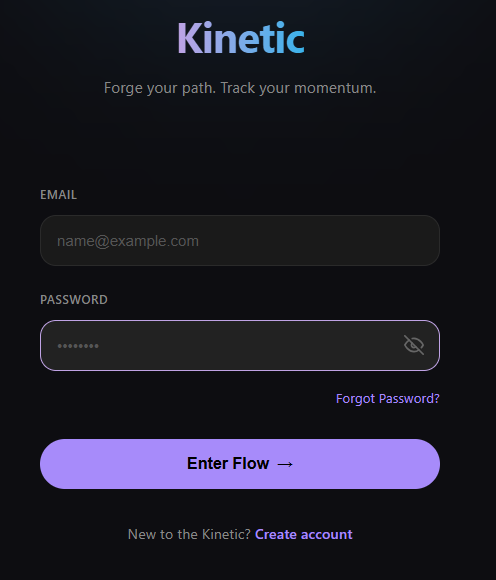

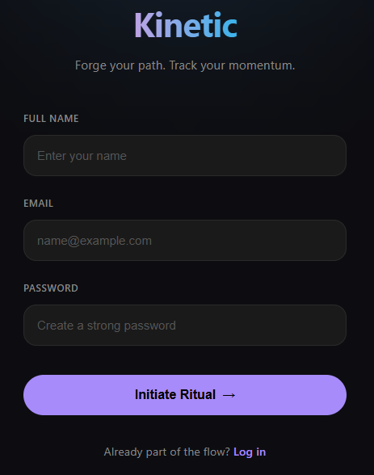
 
### Dashboard użytkownika  

Dashboard stanowi główny ekran aplikacji, prezentujący najważniejsze informacje dotyczące aktywności użytkownika. Znajdują się na nim aktualne nawyki do wykonania, informacje o liczbie zdobytych punktów, długości aktualnej serii wykonywania nawyków oraz wskaźniki przedstawiające postępy użytkownika. 

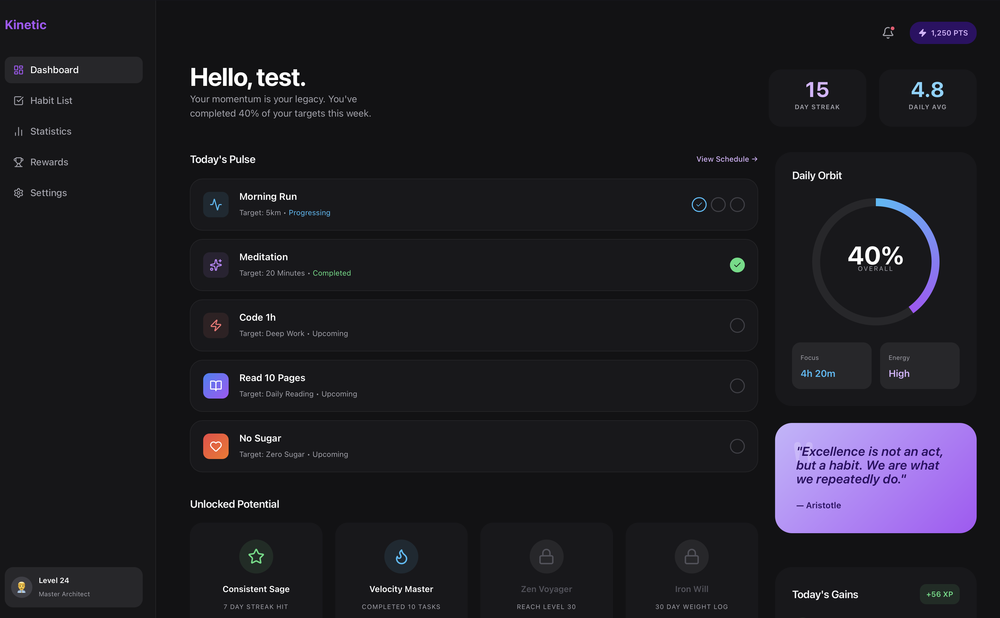

### Zarządzanie nawykami 

Ekran zarządzania nawykami umożliwia przeglądanie wszystkich utworzonych nawyków oraz monitorowanie stopnia ich realizacji. Nawyki zostały podzielone na kategorie, co ułatwia ich wyszukiwanie. 

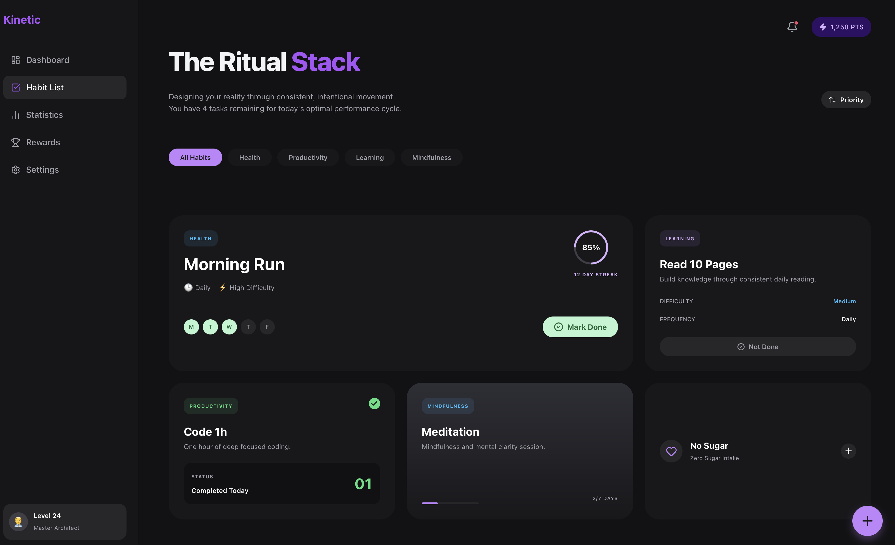

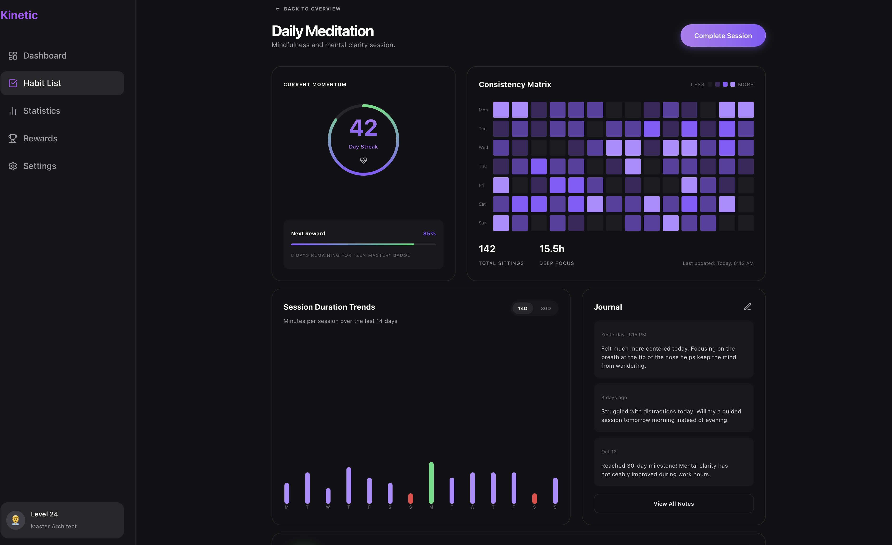

### Statystyki  

Ekran statystyk służy do analizy postępów użytkownika w realizacji nawyków. Prezentowane są tutaj informacje dotyczące liczby aktywnych nawyków, długości serii oraz liczby zdobytych punktów. 

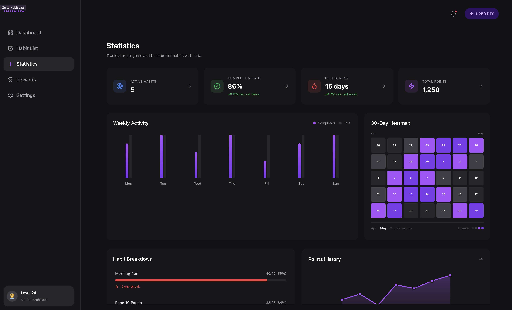

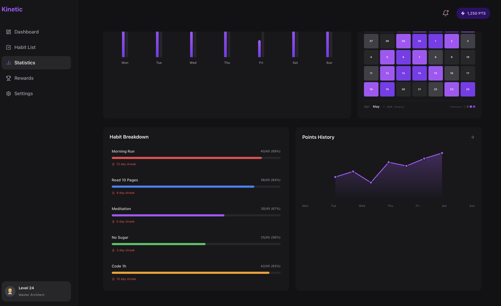

### System nagród  

Ekran nagród odpowiada za motywowanie użytkownika do regularnego wykonywania nawyków. Użytkownik może przeglądać zdobyte odznaki, aktualny poziom doświadczenia oraz swoje miejsce w rankingu. Dodatkowo może wymieniać swoje punkty na nagrody  

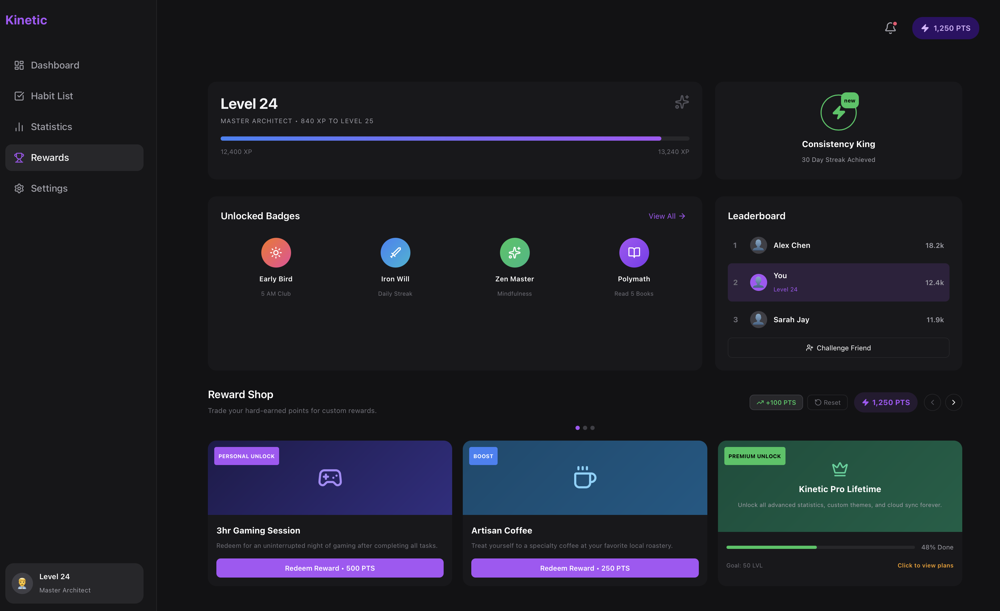

### Ustawienia  

Użytkownik może edytować swoje dane, zarządzać ustawieniami prywatności oraz konfigurować powiadomienia przypominające o realizacji nawyków. 

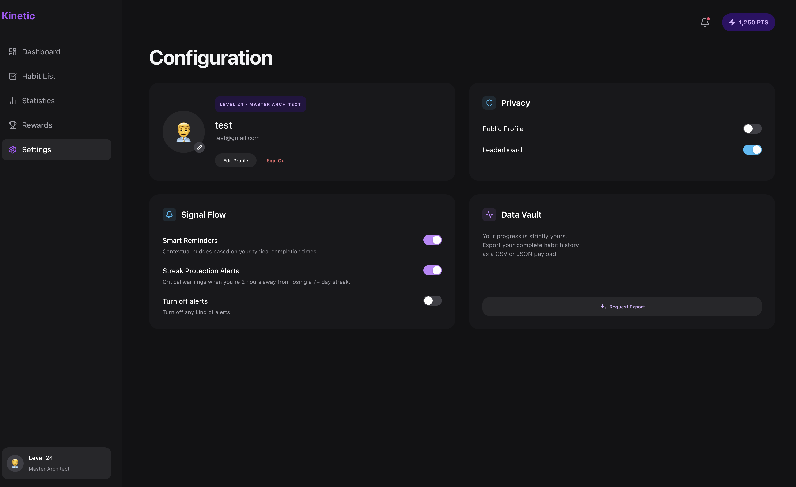

## Hotjar

Hotjar zostanie wykorzystany do obserwacji sposobu korzystania z interfejsu aplikacji przez użytkowników.

Dzięki mapom cieplnym i nagraniom sesji możliwe będzie sprawdzenie, które elementy są najczęściej klikane oraz gdzie użytkownicy mogą napotykać problemy. 

Pozwoli to poprawić użyteczność aplikacji i zwiększyć komfort korzystania z niej. 

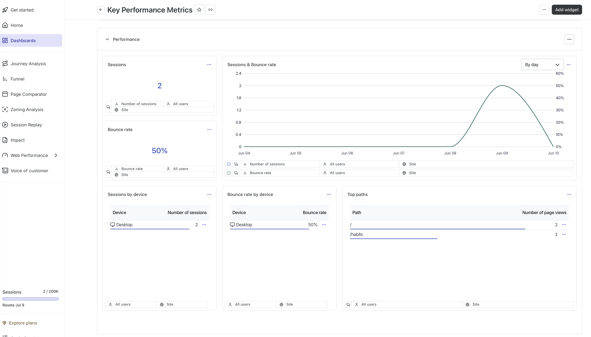

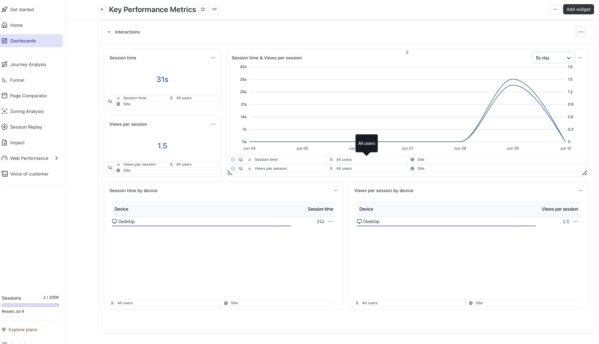

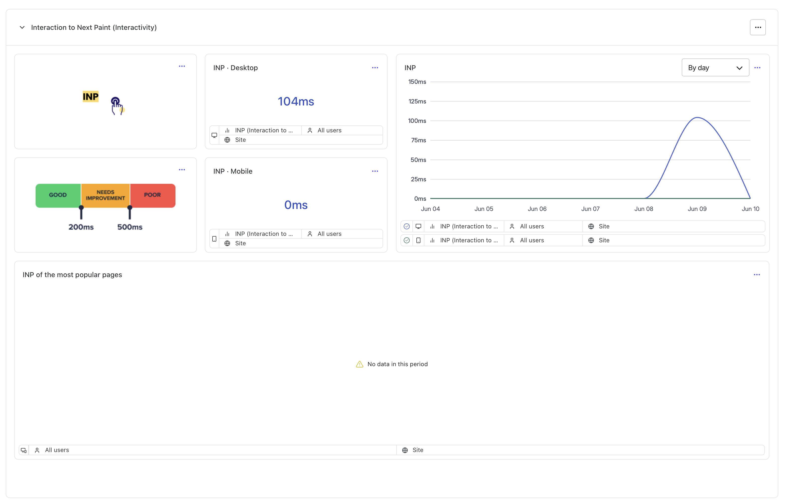

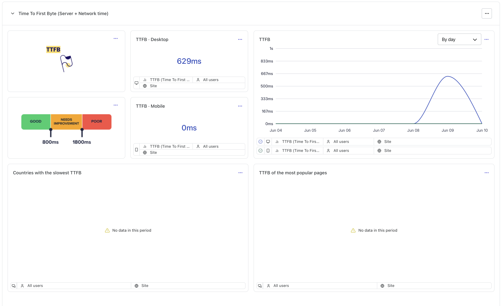

## Google Analitycs

Google Analytics zostanie wykorzystany do analizy zachowań użytkowników w aplikacji. Narzędzie umożliwi sprawdzenie, które ekrany są najczęściej odwiedzane, ile czasu użytkownicy spędzają w aplikacji oraz jakie funkcje cieszą się największym zainteresowaniem.
Zebrane dane pomogą w dalszym ulepszaniu interfejsu i dostosowaniu aplikacji do potrzeb użytkowników. 


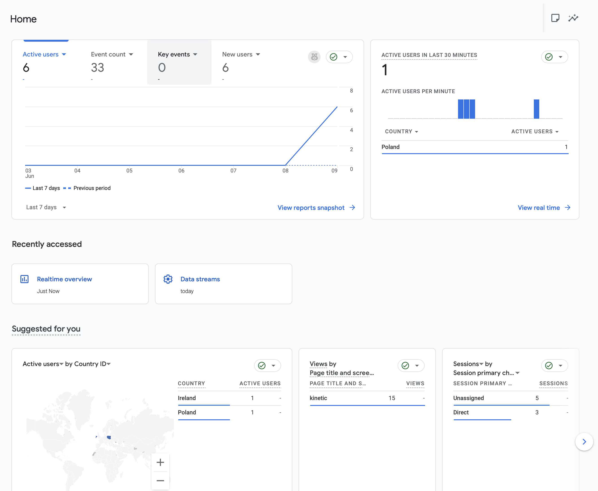

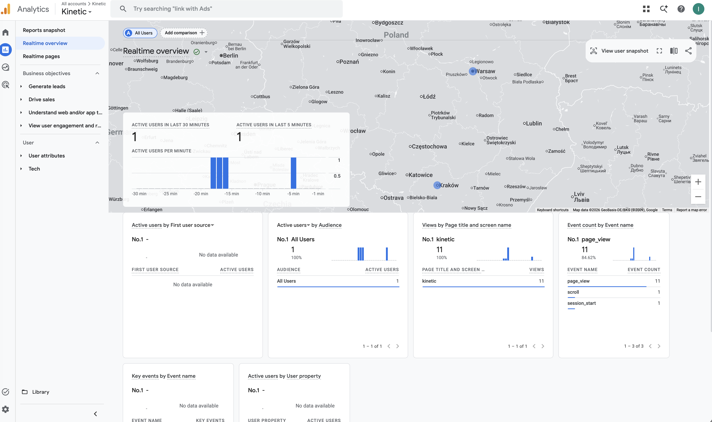

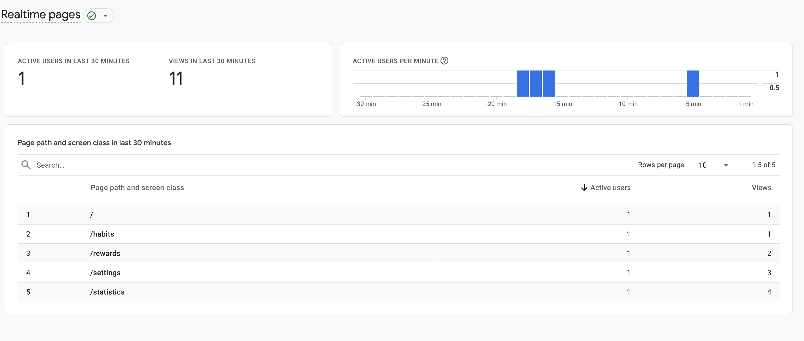
